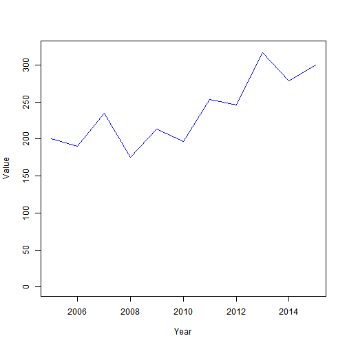
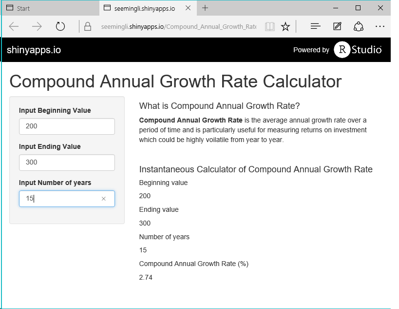

Compound Annual Growth Rate Calculator
========================================================
author: seemingli
date: 27 Sep 2015

Compound Annual Growth Rate (CAGR) aka Annualised Returns
========================================================

Do you ever wonder how much are the returns on your investments in the voilatile financial market?

Fret no more. 

With the Compound Annual Growth Rate calculator at  https://seemingli.shinyapps.io/Compound_Annual_Growth_Rate_Calculator, you can know the CAGR or annualised returns on your investments instantaneously.

What is Compound Annual Growth Rate?
========================================================

- the average annual growth rate over a period of time longer than 1 year
- particularly useful for measuring returns on investment which could be highly voilatile from year to year
- Mathematical Formula :

$$ (\frac{Ending Value}{Beginning Value}) ^{1/number of years} - 1 $$

Example
========================================================
If the value of your investments are as voilatile like this example, you may like to use CAGR to see how the investment fared over different periods like CAGR over 3 years, 5 years and 10 years.
***

```
200 190 235 175 213 197 253 246 317 278 300
```

 

Easy-to-use App
========================================================
Just key in the Beginning Value & Ending Value of your investment and the number of years between the beginning and ending years & voila, you'll have the CAGR instantaneously for comparison!
***



